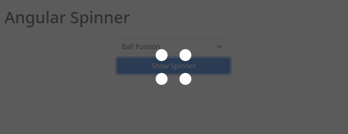

# Angular Spinner


Application example built with [Angular 12](https://angular.io/) and adding the loading (spinner) component using the [ngx-spinner](https://www.npmjs.com/package/ngx-spinner) library.

This tutorial was posted on my [blog]() in portuguese and on the [DEV Community]() in english.


[](https://rodrigo.kamada.com.br)
[](https://www.linkedin.com/in/rodrigokamada)
[](https://twitter.com/rodrigokamada)


## Prerequisites


Before you start, you need to install and configure the tools:

* [git](https://git-scm.com/)
* [Node.js and npm](https://nodejs.org/)
* [Angular CLI](https://angular.io/cli)
* IDE (e.g. [Visual Studio Code](https://code.visualstudio.com/))


## Getting started


### Create the Angular application


**1.** Let's create the application with the Angular base structure using the `@angular/cli` with the route file and the SCSS style format.

```shell
ng new angular-spinner
? Would you like to add Angular routing? Yes
? Which stylesheet format would you like to use? SCSS   [ https://sass-lang.com/documentation/syntax#scss                ]
CREATE angular-spinner/README.md (1060 bytes)
CREATE angular-spinner/.editorconfig (274 bytes)
CREATE angular-spinner/.gitignore (604 bytes)
CREATE angular-spinner/angular.json (3261 bytes)
CREATE angular-spinner/package.json (1077 bytes)
CREATE angular-spinner/tsconfig.json (783 bytes)
CREATE angular-spinner/.browserslistrc (703 bytes)
CREATE angular-spinner/karma.conf.js (1432 bytes)
CREATE angular-spinner/tsconfig.app.json (287 bytes)
CREATE angular-spinner/tsconfig.spec.json (333 bytes)
CREATE angular-spinner/src/favicon.ico (948 bytes)
CREATE angular-spinner/src/index.html (300 bytes)
CREATE angular-spinner/src/main.ts (372 bytes)
CREATE angular-spinner/src/polyfills.ts (2820 bytes)
CREATE angular-spinner/src/styles.scss (80 bytes)
CREATE angular-spinner/src/test.ts (788 bytes)
CREATE angular-spinner/src/assets/.gitkeep (0 bytes)
CREATE angular-spinner/src/environments/environment.prod.ts (51 bytes)
CREATE angular-spinner/src/environments/environment.ts (658 bytes)
CREATE angular-spinner/src/app/app-routing.module.ts (245 bytes)
CREATE angular-spinner/src/app/app.module.ts (393 bytes)
CREATE angular-spinner/src/app/app.component.scss (0 bytes)
CREATE angular-spinner/src/app/app.component.html (24617 bytes)
CREATE angular-spinner/src/app/app.component.spec.ts (1100 bytes)
CREATE angular-spinner/src/app/app.component.ts (220 bytes)
✔ Packages installed successfully.
```

**2.** Install and configure the Bootstrap CSS framework. Do steps 2 and 3 of the post *[Adding the Bootstrap CSS framework to an Angular application](https://github.com/rodrigokamada/angular-bootstrap)*.

**3.** Install the `ngx-spinner` library.

```shell
npm install ngx-spinner
```

**4.** Import the `NgxSpinnerModule` module. Configure the log settings. Change the `app.module.ts` file and add the lines as below.

```typescript
import { NgxSpinnerModule } from 'ngx-spinner';

imports: [
  BrowserModule,
  AppRoutingModule,
  NgxSpinnerModule,
],
```

**5.** Remove the contents of the `AppComponent` class from the `src/app/app.component.ts` file. Import the `NgxSpinnerService` service and create the `showSpinner` method as below.

```typescript
import { Component } from '@angular/core';
import { NgxSpinnerService } from 'ngx-spinner';

@Component({
  selector: 'app-root',
  templateUrl: './app.component.html',
  styleUrls: ['./app.component.scss'],
})
export class AppComponent {

  constructor(private spinnerService: NgxSpinnerService) {
  }

  public showSpinner(): void {
    this.spinnerService.show();

    setTimeout(() => {
      this.spinnerService.hide();
    }, 5000); // 5 seconds
  }

}
```

**6.** Remove the contents of the `src/app/app.component.html` file. Add the button as below.

```html
<div class="container-fluid py-3">
  <h1>Angular Spinner</h1>
  <div class="d-grid gap-2 col-4 mt-4 mx-auto">
    <button type="button" class="btn btn-sm btn-primary" (click)="showSpinner()">Show Spinner</button>
  </div>
</div>

<ngx-spinner size="medium" type="ball-fussion"></ngx-spinner>
```

**7.** Run the application with the command below.

```shell
npm start

> angular-spinner@1.0.0 start
> ng serve

✔ Browser application bundle generation complete.

Initial Chunk Files | Names         |      Size
vendor.js           | vendor        |   2.79 MB
styles.css          | styles        | 266.58 kB
polyfills.js        | polyfills     | 128.51 kB
scripts.js          | scripts       |  76.67 kB
main.js             | main          |  11.04 kB
runtime.js          | runtime       |   6.63 kB

                    | Initial Total |   3.27 MB

Build at: 2021-09-07T01:43:42.126Z - Hash: 52e507be2073bee125a1 - Time: 5289ms

** Angular Live Development Server is listening on localhost:4200, open your browser on http://localhost:4200/ **


✔ Compiled successfully.
```

**8.** Ready! Access the URL `http://localhost:4200/` and check if the application is working. See the application working on [GitHub Pages](https://rodrigokamada.github.io/angular-spinner/) and [Stackblitz](https://stackblitz.com/edit/angular12-spinner).




## Cloning the application

**1.** Clone the repository.

```shell
git clone git@github.com:rodrigokamada/angular-spinner.git
```

**2.** Install the dependencies.

```shell
npm ci
```

**3.** Run the application.

```shell
npm start
```
